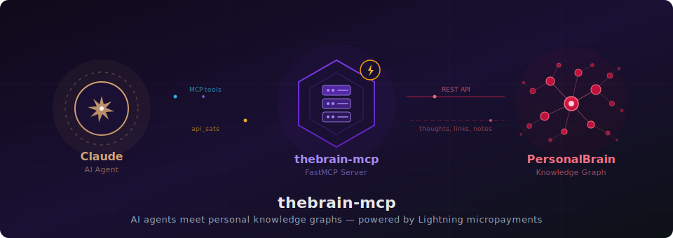

# thebrain-mcp v1.10.0

**The first city on the Lightning Turnpike.**

[](LICENSE)
[](https://www.python.org/)
[](https://www.fastmcp.com/)

<p align="center">
  
</p>

An MCP server that gives AI agents read-write access to a personal knowledge graph — and pays for itself with Bitcoin Lightning micropayments.

> *The metaphors in this project are drawn with admiration from* The Phantom Tollbooth *by Norton Juster, illustrated by Jules Feiffer (1961). Milo, Tock, the Tollbooth, Dictionopolis, and Digitopolis are creations of Mr. Juster's extraordinary imagination. We just built the payment infrastructure.*

---

## The First City

Every turnpike needs its first city. Before the booths can collect fares and the authority can stamp purchase orders, someone has to build a destination worth driving to.

thebrain-mcp is that city — a [FastMCP](https://github.com/jlowin/fastmcp) service deployed on Horizon that bridges AI agents to [TheBrain](https://www.thebrain.com/), a personal knowledge graph of 9,000+ interconnected thoughts built over a decade. Every thought, link, attachment, and note operation maps directly to TheBrain's cloud API at [api.bra.in](https://api.bra.in).

It's also the proving ground for [Tollbooth DPYC™](https://github.com/lonniev/tollbooth-dpyc) — the first MCP server where every tool call is metered via Bitcoin Lightning micropayments. Pre-fund, use, top up. No subscriptions, no API keys tied to billing accounts, no fiat payment processors. The novel contribution: an MCP server architecture where the operator monetizes AI agent access through Lightning micropayments without ever pestering the client mid-conversation.

## Getting Started

### Connecting via Horizon MCP

Connect any MCP-compatible client (Claude Desktop, Cursor, your own agent) to the live endpoint:

```
https://personal-brain.fastmcp.app/mcp
```

No configuration needed — Horizon OAuth handles authentication automatically.

### First Connection Walkthrough

1. **`session_status`** — Check your current session state.
2. Get your **patron npub** from the dpyc-oracle's `how_to_join()` tool — this is the npub you registered as a DPYC™ Citizen, your identity for credit operations.
3. **Secure Courier onboarding:**
   - Call `request_credential_channel(recipient_npub=<patron_npub>)` — opens a Secure Courier channel; sends a welcome DM to your Nostr client.
   - Reply via your Nostr client with your credentials in JSON: `{"api_key": "...", "brain_id": "..."}`
   - Call `receive_credentials(sender_npub=<patron_npub>)` — vaults your credentials and activates the session. A seed balance is granted automatically.
4. **`list_knowledge_bases`** → **`set_active_knowledge_base`** — Select which brain to work with.
5. **`query_knowledge_base`** — Start exploring your knowledge graph.

**Returning users:** call `receive_credentials(sender_npub=<patron_npub>)` — vault-first lookup activates instantly, no relay I/O needed.

### Secure Courier

Credentials are delivered via encrypted Nostr DMs — they never appear in the chat window. On first-time relay receipt, the service sends an `ncred1...` credential card back to the patron via DM for scan-and-paste reuse.

**Human in the loop:** The patron must consciously approve each credential delivery via their Nostr client. Never auto-poll or auto-retry `receive_*` calls — each `receive_credentials` drains the relay destructively (NIP-09 deletion after pickup). Call it exactly once per credential delivery.

## Credits Model

| Category | Pricing hint | Examples |
|----------|-------------|----------|
| `free`   | 0 sats      | `session_status`, `check_balance`, `check_price` |
| `read`   | 1 sat       | `get_knowledge_node`, `search_knowledge_nodes`, `get_note` |
| `write`  | 5 sats      | `create_knowledge_node`, `create_link`, `update_knowledge_node` |
| `heavy`  | 10 sats     | `query_knowledge_base`, `get_modifications` |

Actual prices are set dynamically by the operator's pricing model in Neon via `api_sats` per tool. Auth and balance tools are always free. First-time users receive a seed balance on onboarding — enough to explore without purchasing credits up front.

Credits are issued as tranches with a `tranche_lifetime` (TTL). Tranches are consumed FIFO; expired tranches are pruned automatically. Use `check_balance` to see your balance, active tranches, and usage history. Top up via `purchase_credits` with Bitcoin Lightning.

## Security

- **Identity is a Nostr keypair** — users are identified by an `npub` (Nostr public key), not an email or username. The `nsec` (private key) stays with the patron — never shared, never sent to a service.
- **Proof is a kind-27235 Schnorr-signed NIP-98 event** — every paid tool requires a `proof` parameter. The proof is a JSON-serialized Nostr event signed by the patron's nsec, binding their npub to the specific tool call.
- **Human in the loop** — the patron must sign each proof via their Nostr client. Proofs are never auto-generated or cached by the agent. The proof cache (vault-backed since v0.9.2) stores verified proofs for ~1 hour; renewal requires a fresh request/receive cycle.
- **Credentials via Secure Courier** — TheBrain API keys and brain IDs are delivered via NIP-44 encrypted Nostr DMs, vaulted in Neon Postgres, and never exposed in the chat window.

## BrainQuery (BQL)

A Cypher-subset query language purpose-built for TheBrain. Agents and humans express graph operations in the same formalism — full CRUD via `MATCH`, `CREATE`, `SET`, `MERGE`, and `DELETE`.

```cypher
MATCH (n {name: "Projects"})-[:CHILD]->(m) RETURN m
MATCH (n) WHERE n.name =~ "quarterly review" RETURN n
MATCH (p {name: "Ideas"}) CREATE (p)-[:CHILD]->(n {name: "New Concept"})
MATCH (root {name: "Company"})-[:CHILD*1..3]->(d) WHERE d.name CONTAINS "Budget" RETURN d
```

Variable-length paths, multi-hop chains, compound `WHERE` with `AND`/`OR`/`NOT`/`XOR`, similarity search, and property existence checks. Full grammar in [python/BRAINQUERY.md](python/BRAINQUERY.md).

## Troubleshooting

When a tool call fails, **read the response** — it tells you what happened and what to do next. Credential lifecycle states are not errors; they are expected situations with clear guidance.

| Situation | What to do |
|-----------|------------|
| **proof is required** | Call `request_npub_proof` then `receive_npub_proof` — a fresh request/receive cycle. The cache expires after ~1 hour. |
| **Insufficient credit balance** | Call `purchase_credits` to top up. |
| **Cold start / session not ready** | Retry in 10-15 seconds. Inline retry is available in v0.13.5+. |
| **Credentials not found** | Follow the Secure Courier onboarding flow (step 3 above). |
| **Upstream API error** | Only if the error explicitly mentions TheBrain API failure. Not a credential or billing issue. |

**Don't Pester Your Customer:** Do NOT ask the patron to re-authenticate or re-do the Courier flow unless the error message specifically says credentials are missing or expired.

## Self-Hosting

For local installation, configuration, and the full tool reference, see [python/README.md](python/README.md).

To run your own instance, set these environment variables:

#### Required

| Variable | Purpose |
|----------|---------|
| `TOLLBOOTH_NOSTR_OPERATOR_NSEC` | Operator's Nostr secret key -- the single bootstrap key for identity, Secure Courier DMs, and audit signing |

This is the only env var required to start. Certified operators bootstrap their Neon database URL from the Authority via encrypted Nostr DM -- `NEON_DATABASE_URL` is not read from the environment.

#### Optional Tuning

| Variable | Purpose |
|----------|---------|
| `TOLLBOOTH_NOSTR_RELAYS` | Comma-separated relay URLs (overrides defaults) |
| `THEBRAIN_API_URL` | TheBrain API base URL (default: `https://api.bra.in`) |
| `SEED_BALANCE_SATS` | Free starter balance for new users (0 to disable) |
| `CREDIT_TTL_SECONDS` | Tranche lifetime in seconds (default: 604800 = 7 days) |
| `DPYC_REGISTRY_CACHE_TTL_SECONDS` | How long to cache the DPYC community registry (default: 300) |
| `CONSTRAINTS_ENABLED` | `"true"` to enable constraint engine evaluation on tool calls |

#### Credentials via Secure Courier (NOT env vars)

All secrets flow through Secure Courier -- they never appear as environment variables:

| Credential | Delivery |
|------------|----------|
| TheBrain API key + brain ID | Patron delivers via encrypted Nostr DM |
| BTCPay credentials (`btcpay_host`, `btcpay_api_key`, `btcpay_store_id`) | Operator delivers via Secure Courier |

> **Note:** `THEBRAIN_API_KEY` is not an environment variable. Patrons deliver their TheBrain API key and brain ID via Secure Courier (encrypted Nostr DM). Only the operator's nsec is configured as an env var.

## Actor Protocol

The `BrainOperator` class (in `actor.py`) satisfies `OperatorProtocol` from [tollbooth-dpyc](https://github.com/lonniev/tollbooth-dpyc). It's a thin delegation layer over existing `server.py` tool functions.

```python
from thebrain_mcp.actor import BrainOperator
from tollbooth import OperatorProtocol

assert isinstance(BrainOperator(), OperatorProtocol)
```

The actor exposes:

- **`slug`** — returns `"brain"` for tool-name prefixing
- **`register_standard_tools()`** — delegates standard Tollbooth DPYC™ tools (session, billing, community) to the wheel
- **`tool_catalog()`** — returns `OPERATOR_BASE_CATALOG` (19 `ToolPathInfo` entries) — the canonical tool surface from tollbooth-dpyc

| Path | Tools | Status |
|------|-------|--------|
| Hot (local ledger) | `check_balance`, `account_statement`, `account_statement_infographic`, `restore_credits`, `service_status` | Implemented — delegates to server.py |
| Hot (Secure Courier) | `session_status`, `request_credential_channel`, `receive_credentials`, `forget_credentials` | Implemented — Nostr credential delivery with credential card DM |
| Delegation (Authority) | `purchase_credits`, `check_payment` | Implemented — auto-certifies via MCP-to-MCP |
| Delegation (Authority) | `certify_credits`, `register_operator`, `operator_status` | Stub — connect to the Authority MCP directly |
| Delegation (Oracle) | `lookup_member`, `how_to_join`, `get_tax_rate`, `about`, `network_advisory` | Implemented — MCP-to-MCP via OracleClient |

Payment processing auto-certifies via the Authority (server-to-server OAuth). Secure Courier delivers encrypted credentials via Nostr DMs with automatic credential card (`ncred1...`) DM-back on first receipt. Oracle community tools route directly to the DPYC™ Oracle — free and unauthenticated.

## Architecture

The Tollbooth DPYC™ ecosystem is a three-party protocol spanning three repositories:

| Repo | Role |
|------|------|
| [tollbooth-authority](https://github.com/lonniev/tollbooth-authority) | The institution — tax collection, Schnorr signing, purchase order certification |
| [tollbooth-dpyc](https://github.com/lonniev/tollbooth-dpyc) | The booth — operator-side credit ledger, BTCPay client, tool gating |
| [dpyc-oracle](https://github.com/lonniev/dpyc-oracle) | The concierge — community onboarding, tax rates, membership lookup |
| **thebrain-mcp** (this repo) | The first city — reference MCP server powered by Tollbooth DPYC™ |

See the [Three-Party Protocol diagram](https://github.com/lonniev/tollbooth-authority/blob/main/docs/diagrams/tollbooth-three-party-protocol.svg) for the full architecture. The [operator-side flow](docs/diagrams/tollbooth-protocol-flow.svg) is also available.

## Project Structure

```
thebrain-mcp/
├── python/                  # FastMCP server package
│   ├── src/thebrain_mcp/    # Server source, BQL engine, Tollbooth
│   ├── tests/               # Test suite (525+ tests)
│   ├── README.md            # Install, config, tools, usage
│   └── BRAINQUERY.md        # BQL grammar and reference
├── docs/
│   └── diagrams/            # Architecture and protocol flow diagrams
├── LICENSE                  # Apache License 2.0
└── NOTICE                   # Attribution notice
```

## Prior Art & Attribution

The methods, algorithms, and implementations contained in this repository may represent original work by Lonnie VanZandt, first published on February 16, 2026. This public disclosure establishes prior art under U.S. patent law (35 U.S.C. 102).

All use, reproduction, or derivative work must comply with the Apache License 2.0 included in this repository and must provide proper attribution to the original author per the [NOTICE](NOTICE) file.

### How to Attribute

If you use or build upon this work, please include the following in your documentation or source:

    Based on original work by Lonnie VanZandt and Claude.ai
    Originally published: February 16, 2026
    Source: https://github.com/lonniev/thebrain-mcp
    Licensed under Apache License 2.0

Visit the technologist's virtual cafe for Bitcoin advocates and coffee aficionados at [stablecoin.myshopify.com](https://stablecoin.myshopify.com).

### Patent Notice

The author reserves all rights to seek patent protection for the novel methods and systems described herein. Public disclosure of this work establishes a priority date of February 16, 2026. Under the America Invents Act, the author retains a one-year grace period from the date of first public disclosure to file patent applications.

**Note to potential filers:** This public repository and its full Git history serve as evidence of prior art. Any patent application covering substantially similar methods filed after the publication date of this repository may be subject to invalidation under 35 U.S.C. 102(a).

## DPYC™ Ecosystem

- [dpyc-community](https://github.com/lonniev/dpyc-community) — Registry + governance
- [tollbooth-dpyc](https://github.com/lonniev/tollbooth-dpyc) — Python SDK for Tollbooth DPYC™ monetization
- [tollbooth-authority](https://github.com/lonniev/tollbooth-authority) — Authority MCP service
- [excalibur-mcp](https://github.com/lonniev/excalibur-mcp) — Twitter MCP service
- [schwab-mcp](https://github.com/lonniev/schwab-mcp) — Schwab brokerage MCP service
- [dpyc-oracle](https://github.com/lonniev/dpyc-oracle) — Community concierge
- [tollbooth-sample](https://github.com/lonniev/tollbooth-sample) — Educational weather MCP (canonical reference for new operators)

## Further Reading

[The Phantom Tollbooth on the Lightning Turnpike](https://stablecoin.myshopify.com/blogs/our-value/the-phantom-tollbooth-on-the-lightning-turnpike) — the full story of how we're monetizing the monetization of AI APIs, and then fading to the background.

## Trademarks

DPYC™, Tollbooth DPYC™, and Don't Pester Your Customer™ are trademarks of Lonnie VanZandt. See the [TRADEMARKS.md](https://github.com/lonniev/dpyc-community/blob/main/TRADEMARKS.md) in the dpyc-community repository for usage guidelines.

## License

Apache License 2.0 — see [LICENSE](LICENSE) and [NOTICE](NOTICE) for details.

---

*Because in the end, the tollbooth was never the destination. It was always just the beginning of the journey.*
